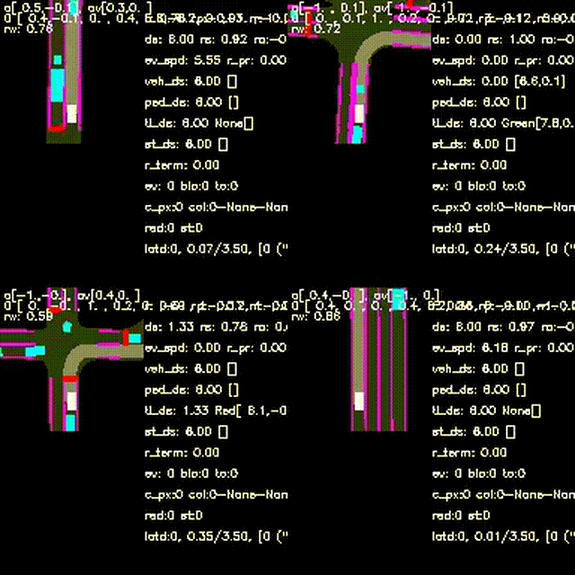
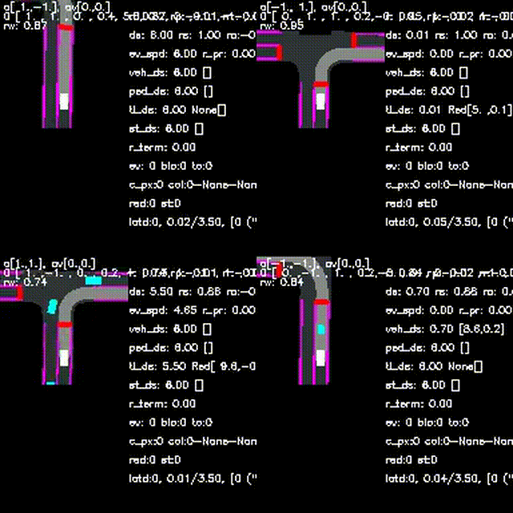
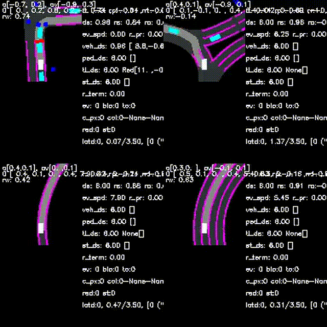
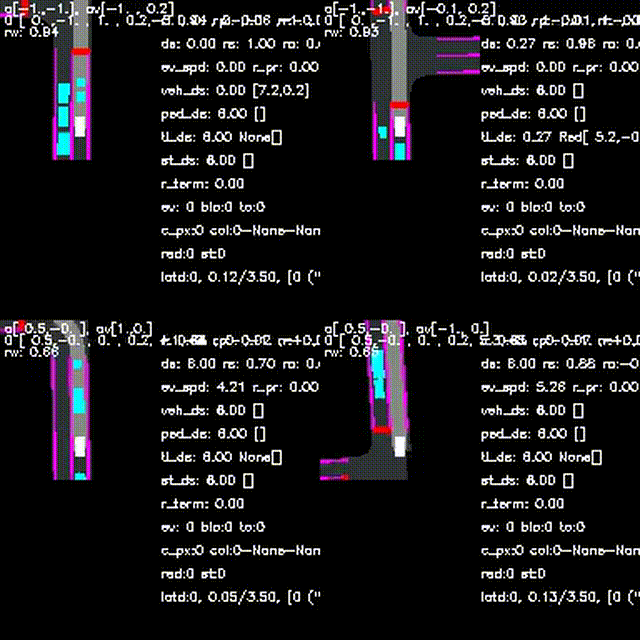
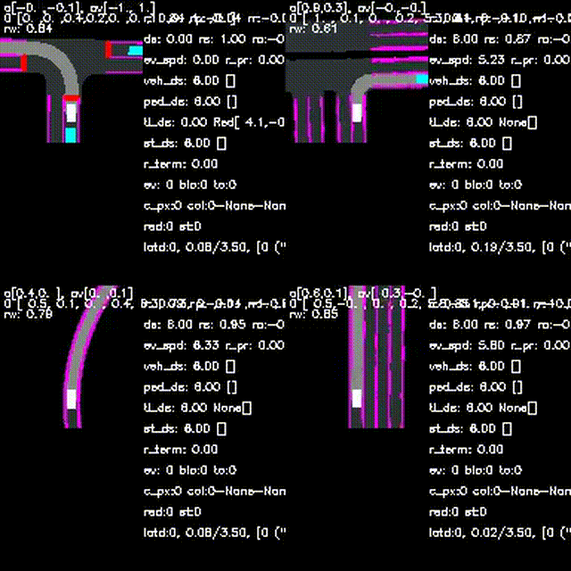
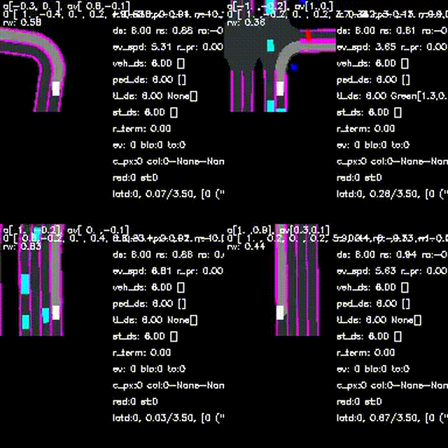

# Found-RL: Foundation Model-Enhanced Reinforcement Learning for Autonomous Driving

This repository contains the official implementation of our paper on foundation model-enhanced reinforcement learning for autonomous driving in CARLA.

**Paper**: [Found-RL: foundation model-enhanced reinforcement learning for autonomous driving](https://arxiv.org/abs/2602.10458)  
**Website**: [https://ys-qu.github.io/found-rl-website/](https://ys-qu.github.io/found-rl-website/)  
**Code**: [GitHub Repository](https://github.com/ys-qu/found-rl)  
**Dataset**: [🤗 HuggingFace Dataset](https://huggingface.co/datasets/ys-qu/found-rl_dataset)  
**VLMs**: [🤗 HuggingFace VLMs](https://huggingface.co/ys-qu/found-rl_vlms)

## Authors

[Yansong Qu](https://scholar.google.com/citations?user=hIt7KnUAAAAJ&hl=en&oi=sra), [Zihao Sheng](https://scholar.google.com/citations?user=3T-SILsAAAAJ&hl=en), [Zilin Huang](https://scholar.google.com/citations?user=RgO7ppoAAAAJ&hl=en), [Jiancong Chen](https://scholar.google.com/citations?user=qa_mJTUAAAAJ&hl=en), [Yuhao Luo](https://scholar.google.com/citations?user=CNdSjWAAAAAJ&hl=en), [Tianyi Wang](https://scholar.google.com/citations?user=4l_kJY0AAAAJ&hl=en), [Yiheng Feng](https://scholar.google.com/citations?user=Ykk41g4AAAAJ&hl=en), [Samuel Labi](https://scholar.google.com/citations?user=hCXBQl8AAAAJ&hl=en), [Sikai Chen\*](https://scholar.google.com/citations?user=DPN2wc4AAAAJ&hl=en)

*Purdue University, University of Wisconsin-Madison, University of Texas at Austin*  
\*Indicates Corresponding Author

## Overview

This project integrates foundation models, especially vision-language models (VLMs), with reinforcement learning to improve autonomous driving performance in the CARLA simulator. The framework supports multiple RL algorithms and incorporates foundation models for enhanced learning performance through:

- **Asynchronous batch inference framework**: Efficient batch processing of VLM requests
- **VLM-guided actions**: Using vision-language models to provide VLM expert actions
- **CLIP-based reward shaping**: Leveraging CLIP for safety-aware reward bonuses

### Comparison with Other Paradigms


*Comparison of supervision paradigms for autonomous driving. (a) Normal RL is sample inefficient and "scattergun" (like self-study using a textbook), requiring extensive risky exploration. (b) Human-in-the-loop RL is informative but hard to scale due to human availability (like asking teachers questions—accurate but too demanding for teachers). (c) Foundation Model-enhanced RL offers a transformative third path: Foundation Models (specifically VLMs) function as a "Tireless Mentor" that are "Always Ready" to provide scalable feedback. VLMs can interpret complex driving scenes and generate meaningful supervision signals, potentially combining the data efficiency of imitation learning with the self-exploration of RL. However, integrating these computationally heavy models into multi-environment high-frequency RL pipelines remains a significant engineering hurdle due to inference latency and the lack of unified frameworks. Found-RL addresses this gap with an asynchronous batch inference framework that decouples heavy VLM reasoning from the real-time simulation loop, enabling real-time or near-real-time training with online supervision from VLMs.*

## Features

- 🚗 **Multiple RL Algorithms**: Support for DrQv2, SAC, TD3, PPO, and DDPG (but only DrQv2 and SAC support learning from VLM feedback)
- 🤖 **Foundation Model Integration**: Seamless integration with fine-tuned VLM experts (Visual RWKV, Qwen, InternVL, CLIP, etc.)
- 🎯 **CLIP Reward Shaping**: Safety-aware reward bonuses (it learns from implicit guidance, but the performance is as good as explicit action guidance)
- ⚡ **Asynchronous Batch Processing**: Efficient asynchronous batch inference for VLM requests
- 📊 **Comprehensive Evaluation**: Support for multiple CARLA benchmarks (Leaderboard, NoCrash, etc.)
- 🔧 **Flexible Configuration**: Hydra-based configuration system

## Installation

### Prerequisites

- Python 3.10
- CUDA-capable GPU (recommend >=24GB when using VLMs for action guidance; ~16GB is enough for CLIP-based reward shaping)
- CARLA 0.9.15 ([Download](https://github.com/carla-simulator/carla/releases/tag/0.9.15))

### Setup

1. **Clone the repository**:
```bash
git clone https://github.com/ys-qu/found-rl.git
cd found_rl
```

2. **Create a conda environment**:
```bash
conda create -n found_rl python=3.10
conda activate found_rl
```

3. **Install PyTorch** (install PyTorch first before other dependencies, make sure cuda version is right):
```bash
pip install torch torchvision torchaudio --index-url https://download.pytorch.org/whl/cu128
```

4. **Install other dependencies**:
```bash
pip install -r requirements.txt
```

5. **In case of Unable to load any of {libcudnn_graph.so.9.10.2, libcudnn_graph.so.9.10, libcudnn_graph.so.9, libcudnn_graph.so}**:
```bash
export LD_LIBRARY_PATH="$CONDA_PREFIX/lib/python3.10/site-packages/nvidia/cudnn/lib:$LD_LIBRARY_PATH"
```

6. **Set up Weights & Biases (WandB)**:
   you need to log in before training:
```bash
# Login to WandB (required for logging training metrics)
# You'll need to create a free account at https://wandb.ai if you don't have one
wandb login
```

## Configuration

Before starting training, you need to configure the following files:

The project uses [Hydra](https://hydra.cc/) for configuration management. To set up training, you need to configure three main files:

### 1. Training Script (`scripts/train_rl_asycn_vlm.sh`)

Edit the `train_rl()` function to configure your training:

```bash
train_rl () {
  python -u train_rl_asycn_vlm.py \
  agent.rl_vlm.wb_run_path=null \
  wb_project=found_rl wb_name=your_experiment_name \
  agent/rl_vlm/training=drqv2_vlm \  # Choose algorithm, drqv2_vlm and sac_vlm support learning with VLM feedback, clip-based reward shaping is not supprted for SAC so far
  carla_sh_path=${CARLA_ROOT}/CarlaUE4.sh
}
```

**Required changes:**
- **Line 3**: Set `CARLA_ROOT`:
  ```bash
  export CARLA_ROOT=/path/to/CARLA_0.9.15
  ```
  **Note**: It's recommended to set `carla_sh_path` directly in `config/train_rl_asycn_vlm.yaml` instead of using environment variables.
- **Line 50**: Choose your RL algorithm by setting `agent/rl_vlm/training`:
  - `drqv2_vlm` - Data-regularized Q-v2
  - `sac_vlm` - Soft Actor-Critic
- **Line 56**: Update conda path to match your system:
  ```bash
  source /path/to/your/conda/etc/profile.d/conda.sh
  conda activate found_rl
  ```

### 2. Main Training Config (`config/train_rl_asycn_vlm.yaml`)

Configure VLM guidance methods and model paths:

```yaml
# Choose which VLM guidance method to use
start_llm_server: false  # Set to true for VLM-guided actions (VMR/AWAG)
llm_model_path: "/path/to/your/vlm/model"  # Path to your VLM model

start_clip_server: true  # Set to true for CLIP-based reward shaping
clip_model_path: "/path/to/your/clip/model"  # Path to your CLIP model (OpenCLIP models, pt files)

# Training settings
total_timesteps: 1e6
carla_sh_path: "/path/to/CARLA_0.9.15/CarlaUE4.sh"  # Path to CARLA executable, but actually this will be updated automatically
```

**Recommended VLMs:**

We recommend using **InternVL3-1B-BEV** as the default VLM for action guidance (VMR/AWAG), which is what we used in our experiments. You can download it from [HuggingFace](https://huggingface.co/ys-qu/found-rl_vlms/tree/main/internvl3_1b_full_sft_bev):

```python
from huggingface_hub import snapshot_download

# Download InternVL3-1B-BEV model (recommended for action guidance)
model_path = snapshot_download(
    repo_id="ys-qu/found-rl_vlms",
    allow_patterns="internvl3_1b_full_sft_bev/**",
    local_dir="./models"
)
# Then set llm_model_path in config to: "./models/internvl3_1b_full_sft_bev"
```

For CLIP-based reward shaping, download the fine-tuned CLIP model from [HuggingFace](https://huggingface.co/ys-qu/found-rl_vlms/blob/main/clip_laion2b_epoch_10_new.pt):

```python
from huggingface_hub import hf_hub_download

# Download CLIP model for reward shaping
clip_path = hf_hub_download(
    repo_id="ys-qu/found-rl_vlms",
    filename="clip_laion2b_epoch_10_new.pt",
    local_dir="./models"
)
# Then set clip_model_path in config to: "./models/clip_laion2b_epoch_10_new.pt"
```

**VLM Guidance Methods:**
- **VLM-guided actions** (`start_llm_server: true`): Uses VLM to provide action suggestions
  - Requires: `llm_model_path` pointing to your VLM model (recommended: InternVL3-1B-BEV)
  - Used with: `pvp` or `awac` in algorithm config (see below)
- **CLIP reward shaping** (`start_clip_server: true`): Uses CLIP for safety-aware reward bonuses
  - Requires: `clip_model_path` pointing to your CLIP model (recommended: clip_laion2b_epoch_10_new.pt)
  - Used with: `r_clip` in algorithm config (see below)

### 3. Algorithm-Specific Config (`config/agent/rl_vlm/training/drqv2_vlm.yaml`)

Choose the VLM guidance method for your selected algorithm. Example for `drqv2_vlm.yaml`:

```yaml
kwargs:
  use_vlm: 'r_clip'  # Options: 'pvp', 'awac', 'r_clip'
```

**VLM Guidance Method Mapping:**
- **`pvp`** → **VMR (Value-Margin Regularization)**: VLM provides action suggestions with value-margin regularization
  - Requires: `start_llm_server: true` in main config
  - Use when: You want VLM-guided actions with value-based regularization
  
- **`awac`** → **AWAG (Advantage-Weighted Action Guidance)**: VLM provides action suggestions weighted by advantage
  - Requires: `start_llm_server: true` in main config
  - Use when: You want advantage-weighted VLM action guidance
  
- **`r_clip`** → **CLIP-based Reward Shaping**: CLIP provides semantic reward bonuses
  - Requires: `start_clip_server: true` in main config
  - Use when: You want dense supervision via CLIP embeddings

**Configuration Summary Table:**

| Method | `use_vlm` | `start_llm_server` | `start_clip_server` | Model Path Config |
|--------|-----------|-------------------|---------------------|-------------------|
| VMR | `pvp` | `true` | `false` | Set `llm_model_path` in `train_rl_asycn_vlm.yaml` |
| AWAG | `awac` | `true` | `false` | Set `llm_model_path` in `train_rl_asycn_vlm.yaml` |
| CLIP Reward | `r_clip` | `false` | `true` | Set `clip_model_path` in `train_rl_asycn_vlm.yaml` |

**Note**: You can also combine methods (e.g., use both `start_llm_server: true` and `start_clip_server: true`), and use `use_vlm` like `pvp|r_clip`, but I am not sure if this will improve the performance or not, since both vlms and clip we use were trained using the same dataset, so both of them are projecting similar 'expertness' to RL agents in different formats.

### Key Configuration Options

**Training** (`config/train_rl_asycn_vlm.yaml`):
- `agent/rl_vlm/training`: RL algorithm (drqv2_vlm, sac_vlm, td3_vlm, ppo_vlm, ddpg_vlm)
- `agent/rl_vlm/policy`: Policy type (drqv2_xtma, sac_xtma_gaus, etc.), no need to change.
- `total_timesteps`: Total training timesteps
- `start_clip_server`: Enable CLIP-based reward shaping
- `start_llm_server`: Enable VLM-guided actions
- `carla_sh_path`: Path to CARLA executable

**Evaluation** (`config/eval_rl_vlm.yaml`):
- `test_suites`: Benchmark suite (lb_test, eu_test, etc.)
- `n_episodes`: Number of evaluation episodes
- `local_ckpt_path`: Path to checkpoint file

### Available RL Algorithms

- `drqv2_vlm`: Data-regularized Q-v2 (with VLM supoort)
- `sac_vlm`: Soft Actor-Critic (with VLM supoort)
- `td3`: Twin Delayed DDPG
- `ppo`: Proximal Policy Optimization
- `ddpg`: Deep Deterministic Policy Gradient

## Quick Start

### Training

1. **Configure paths in config files** (see Configuration section above):
   - Set `carla_sh_path` in `config/train_rl_asycn_vlm.yaml`
   - Set `llm_model_path` and/or `clip_model_path` if using VLM guidance
   - Update conda path in `scripts/train_rl_asycn_vlm.sh` (line 56)

2. **Run training script**:
```bash
sh scripts/train_rl_asycn_vlm.sh
```

### Evaluation

After training, you can evaluate your trained model. For evaluation, you need to configure the following:

**1. Evaluation Script (`scripts/eval_rl_vlm.sh`)**:
```bash
# Line 4: Set CARLA_ROOT (optional, can also set in config)
export CARLA_ROOT=/path/to/CARLA_0.9.15

# Line 34: Choose RL algorithm (must match your training algorithm)
agent/rl_vlm/training=drqv2_vlm  # or sac_vlm

# Line 32: Choose test suite
test_suites=lb_test  # Options: lb_test, eu_test, cc_test, nocrash_dense

# Line 41: Update conda path to match your system
source /path/to/your/conda/etc/profile.d/conda.sh
conda activate found_rl
```

**2. Evaluation Config (`config/eval_rl_vlm.yaml`)**:
```yaml
# Set path to your trained checkpoint
local_ckpt_path: "/path/to/your/checkpoint.zip"  # Path to checkpoint from training
```

**3. Run evaluation**:
```bash
sh scripts/eval_rl_vlm.sh
```

**Note**: Most parameters are already configured during training. For evaluation, you only need to set:
- `test_suites`: Which benchmark to evaluate on
- `agent/rl_vlm/training`: Which algorithm you trained (must match training)
- `local_ckpt_path`: Path to your trained checkpoint
- `CARLA_ROOT` and conda path in the script (if not using config file paths)

### VLM-Only Evaluation

You can also evaluate VLM-only agents (without RL training), but this requires downloading large VLM models from [🤗 found-rl_vlms](https://huggingface.co/ys-qu/found-rl_vlms). The evaluation process can take a very long time, and we do not recommend this unless you specifically need to evaluate standalone VLM performance.

If you still want to proceed:

1. **Download VLM models** from the HuggingFace link provided above
2. **Configure** `config/eval_vlm.yaml`:
   ```yaml
   model_name_or_path: "/path/to/your/vlm/model"  # Path to downloaded VLM model
   carla_sh_path: "/path/to/CARLA_0.9.15/CarlaUE4.sh"
   ```
3. **Run evaluation**:
   ```bash
   sh scripts/eval_vlm.sh
   ```

**Additional notes:**
- **RGB-version VLMs**: If you want to test RGB-version VLMs, ensure the RGB camera is enabled in the config and that `obs['central_rgb']['data']` is passed from the environment. (In our experiments, we only tested VLMs with BEV as inputs)
- **Visual RWKV**: To use Visual RWKV, you must download it from [VisualRWKV v7.00](https://github.com/howard-hou/VisualRWKV/tree/main/VisualRWKV-v7/v7.00).

### Extracting Final Metrics

After evaluation, use `clean_wandb_data.py` to extract final metrics from WandB logs. This script is especially important for calculating the **corrected success rate**.

**Why is this needed?** We found that sometimes the percentage of RL agents with route completion (score_route) >= 0.999 is greater than the original success rate reported by CARLA. Therefore, we redefine **success rate** based on route completion rather than CARLA's original metric. This redefinition is used throughout all experiments in the paper.

**How success rate is redefined:**

The script calculates two metrics:

1. **Arrival Rate**: Percentage of episodes where `score_route >= 0.999` (i.e., the agent completed the route). This is our redefined **success rate** - simply the percentage of agents that completed the route.

2. **Strict Success Rate**: Percentage of episodes where `score_route >= 0.999` AND the agent had no infractions (no collisions, red light violations, stop sign violations, route deviations, etc.). This is a stricter metric that requires both route completion and perfect driving behavior.

**Usage:**

1. **Configure** `clean_wandb_data.py`:
   ```python
   WANDB_ENTITY = "your-wandb-entity"  # Your WandB entity name
   WANDB_PROJECT = "found_rl"  # Your WandB project name
   TARGET_GROUP = "your-group-name"  # Group name to filter runs
   NAME_KEYWORD = "test"  # String that must be included in run name, we use it a filter
   ```

2. **Run the script**:
   ```bash
   python clean_wandb_data.py
   ```

The script will:
- Calculate **Arrival Rate** (redefined success rate): Percentage of episodes with `score_route >= 0.999`
- Calculate **Strict Success Rate**: Percentage of episodes with `score_route >= 0.999` AND no infractions
- Extract and aggregate all metrics from evaluation runs
- Log summary tables back to WandB for easy viewing

**Important**: The script logs two tables to WandB:
- `Full_Summary`: Complete metrics table
- `Brief_Summary`: Key metrics only (Strict Success Rate, Arrival Rate, collisions, etc.)

## Error Diagnosis

Common errors and solutions:

**`ValueError: max() arg is an empty sequence`** (in `agents/rl_vlm/rl_vlm_agent.py`, line 51, in `setup`):
```
f = max(all_ckpts, key=lambda x: int(x.name.split('_')[1].split('.')[0]))
```
**Solution**: Delete the `outputs` folder. This error occurs when you start training, stop it very early (before any checkpoint is saved), and then try to resume. The program expects existing checkpoints to resume from but finds none. Delete `outputs` to start fresh.

**`ModuleNotFoundError: No module named 'pkg_resources'`**  
**Solution**: Install an older setuptools: `pip install "setuptools<70.0.0"` (use your environment's pip, e.g. `/venv/found_rl/bin/pip install "setuptools<70.0.0"` for a venv).

## Results

### Training Performance


*Training curves showing reward and route completion (in meters per step), demonstrating that with VLM feedback, RL learns faster and achieves better performance.*

### Driving Demos

The following demos showcase Found-RL agents navigating complex scenarios in CARLA:

| DrQv2 + VMR (LB) | DrQv2 + VMR (EU) |
|:---:|:---:|
|  |  |

| DrQv2 + AWAG (LB) | DrQv2 + AWAG (EU) |
|:---:|:---:|
|  |  |

| SAC + VMR (LB) | SAC + AWAG (LB) |
|:---:|:---:|
|  |  |

## Project Structure

```
found_rl/
├── agents/rl_vlm/          # Main RL+VLM agent implementation
├── carla_gym/              # CARLA environment wrapper
├── config/                 # Hydra configuration files
├── scripts/                # Training and evaluation scripts
├── utils/                  # Utility modules
├── bc_stage/               # Behavioral cloning stage for VLM fine-tuning, standalone folder
├── assets/                 # Figures and demo GIFs
├── train_rl_asycn_vlm.py   # Main training entry point
├── eval_rl_vlm.py          # RL+VLM evaluation entry point
├── eval_vlm.py             # VLM-only evaluation entry point
├── clean_wandb_data.py     # WandB data cleaning script
└── requirements.txt         # Python dependencies
```

## Citation

If you use this code in your research, please cite:

```bibtex
@misc{qu2026foundrlfoundationmodelenhancedreinforcement,
      title={Found-RL: foundation model-enhanced reinforcement learning for autonomous driving}, 
      author={Yansong Qu and Zihao Sheng and Zilin Huang and Jiancong Chen and Yuhao Luo and Tianyi Wang and Yiheng Feng and Samuel Labi and Sikai Chen},
      year={2026},
      eprint={2602.10458},
      archivePrefix={arXiv},
      primaryClass={cs.AI},
      url={https://arxiv.org/abs/2602.10458}, 
}
```

## Acknowledgments

This codebase is built upon:
- [Roach](https://github.com/zhejz/carla-roach) - Original CARLA RL framework
- [Stable-Baselines3](https://github.com/DLR-RM/stable-baselines3) - RL algorithms
- [DRQv2](https://github.com/facebookresearch/drqv2) - Data-regularized Q-learning

## License

This project is licensed under the Apache License 2.0 - see the [LICENSE](LICENSE) file for details.

## A Note for Researchers

We have preserved several functions and utilities in the codebase that were not used in our paper experiments. Found-RL is designed as an extensible platform—we encourage you to explore, experiment with different configurations, and build upon it for your own research.

## Contact

For questions or issues, please open an issue on GitHub or contact:
- **Yansong Qu** - Purdue University
